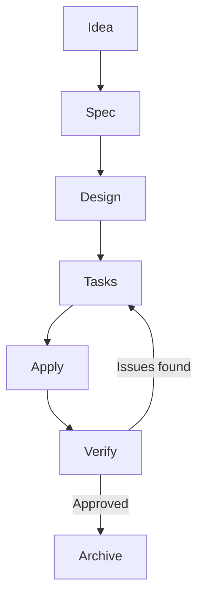

# [L32] Gestión Empresarial con Obsidian

> **Módulo:** M5 — Obsidian y Gestión Empresarial  
> **Lección:** L32  
> **Tags:** `obsidian` `gestión-equipos` `mermaid` `trello-api` `sprints` `code-review` `prompt-engineering`

---

## 🧠 Core Insights

El mismo sistema de Obsidian que funciona para el conocimiento personal escala directamente para gestionar proyectos de equipo. La diferencia no está en la herramienta — está en la estructura de la vault y en las integraciones con herramientas externas. La ventaja sobre Notion u otras herramientas de gestión visual no es la interfaz: es que cada nota es un archivo que Claude Code puede leer, editar y conectar sin que nadie tenga que navegar pantallas manualmente.

Una vault de equipo bien estructurada tiene carpetas que mapean la realidad del trabajo: **Proyectos activos** (una nota por iniciativa), **Sprints** (tareas del ciclo actual), **Clientes** (contexto de cada relación), **Decisiones** (registro de qué se decidió y por qué), y **Retrospectivas** (aprendizajes después de cada ciclo). Con esa estructura, el agente puede hacer un barrido completo de todos los proyectos, identificar tareas sin asignación, plazos en riesgo y cuellos de botella que aparecen en múltiples proyectos simultáneamente. Una revisión que en cualquier herramienta visual requeriría navegar pantallas durante minutos, aquí ocurre en segundos.

Obsidian soporta **Mermaid de forma nativa** — un bloque de código Mermaid dentro de cualquier nota se renderiza automáticamente como diagrama visual. Diagramas de flujo, arquitecturas de sistema, timelines de proyecto, diagramas de secuencia — todos generables desde lenguaje natural. Le describes el flujo a Claude Code y él escribe el Mermaid.

La integración con **Trello vía API** invierte la relación típica entre la herramienta de notas y la herramienta de gestión: la nota de Markdown es la **fuente de verdad**, y Trello es la **vista de seguimiento del equipo**. El sprint se define en Markdown, el agente crea las tarjetas en Trello con la API. Al final del sprint, el agente consulta el estado de las tarjetas y actualiza la nota de retrospectiva. Nadie usa la interfaz de Trello para crear el sprint manualmente.

El **prompt de code review estructurado** tiene tres pilares que lo separan de un prompt genérico: especificidad (qué buscar exactamente, no órdenes vagas), contexto (stack del proyecto, convenciones del equipo, restricciones de negocio), y estructura (formato exacto de salida para poder priorizar y resolver). Cuando el estándar está documentado en la vault, el agente lo ejecuta de forma consistente en cada auditoría — sin depender de lo que decida en cada sesión.

La estrategia pragmática de cobertura de tests documentada en el guion: **100% en lógica de negocio core, 80% en el resto del código, 0% en infraestructura** (cubierta con tipado estricto). Documentarla en la vault significa que el agente la aplica automáticamente al generar tests o auditar cobertura.

## ⚙️ Implementación Práctica

**Estructura de vault de equipo:**
```
vault-equipo/
├── cloud.md              ← reglas del sistema para el equipo
├── Index.md              ← mapa de navegación del agente
├── Proyectos/
│   ├── proyecto-alpha.md
│   └── proyecto-beta.md
├── Sprints/
│   ├── sprint-2025-Q2-W3.md   ← sprint activo
│   └── sprint-2025-Q2-W2.md   ← cerrado
├── Clientes/
│   └── cliente-x.md
├── Decisiones/
│   └── 2025-05-15-decision-precio-pro.md
└── Retrospectivas/
    └── retro-sprint-2025-Q2-W2.md
```

**Diagrama de flujo con Mermaid (Claude Code lo genera desde descripción):**


**Matriz de Eisenhower en Markdown:**
```markdown
## Matriz de Eisenhower — Q2 2025

| | Urgente | No Urgente |
|---|---|---|
| **Importante** | [[Tarea A]], [[Tarea B]] | [[Iniciativa X]], [[Iniciativa Y]] |
| **No Importante** | [[Bug Z]] | Backlog |
```

**Plantilla de historia de usuario:**
```markdown
---
tipo: historia-de-usuario
proyecto: [[Proyecto Alpha]]
sprint: [[Sprint 2025-Q2-W3]]
prioridad: alta
estimacion: 3 puntos
---

## Historia
Como [tipo de usuario], quiero [acción], para [beneficio].

## Criterios de aceptación
- [ ] Criterio 1
- [ ] Criterio 2
- [ ] Criterio 3

## Notas técnicas
```

**Script Python para sincronización Trello:**
```python
import requests
import re

# Config — guardar en cloud.md o .env
TRELLO_API_KEY = "tu_api_key"
TRELLO_TOKEN = "tu_token"
BOARD_ID = "id_del_tablero"
LIST_ID = "id_de_la_lista_del_sprint"

def crear_tarjeta_trello(nombre, descripcion, id_lista):
    url = "https://api.trello.com/1/cards"
    params = {
        "key": TRELLO_API_KEY,
        "token": TRELLO_TOKEN,
        "idList": id_lista,
        "name": nombre,
        "desc": descripcion
    }
    response = requests.post(url, params=params)
    return response.json()

def parsear_sprint_desde_nota(ruta_nota):
    with open(ruta_nota) as f:
        contenido = f.read()
    # Extraer tareas: líneas con "- [ ]"
    tareas = re.findall(r"- \[ \] (.+)", contenido)
    return tareas

# Uso
tareas = parsear_sprint_desde_nota("Sprints/sprint-activo.md")
for tarea in tareas:
    resultado = crear_tarjeta_trello(tarea, "", LIST_ID)
    print(f"Creada: {resultado['shortUrl']}")
```

**Prompt de code review estructurado:**
```
Revisa el siguiente código con estos criterios específicos:

STACK: [Python 3.11 / FastAPI / PostgreSQL]
CONVENCIONES DEL EQUIPO: [descripción en cloud.md sección "Estándares"]

BUSCA:
1. Memory leaks y recursos no liberados
2. Problemas de performance (N+1 queries, loops innecesarios)
3. Violaciones de principios SOLID
4. Casos borde no cubiertos por los tests existentes
5. Violaciones de las convenciones del equipo documentadas arriba

FORMATO DE SALIDA (estricto):
| Archivo | Línea | Tipo | Descripción | Solución sugerida |
|---------|-------|------|-------------|-------------------|

Código a revisar: [código]
```

## 📌 Notas y Alertas

> 🔴 **Importante:** La nota de Markdown es la fuente de verdad del sprint — Trello es solo la vista de seguimiento del equipo. Esta inversión de roles es la clave de la arquitectura: si Trello deja de existir mañana, tu sprint sigue documentado en Markdown. Si Notion cierra, lo mismo. El conocimiento y la planificación no dependen de ninguna plataforma externa para existir.

> ⚠️ **Advertencia:** Un prompt de auditoría de código sin estructura de salida definida produce resultados que no se pueden priorizar ni procesar sistemáticamente. "Revisa este código" da un párrafo de texto libre. El mismo prompt con formato de salida estricto (archivo, línea, tipo, solución) da una tabla que el equipo puede ordenar por severidad e integrar directamente al backlog. La diferencia está en la especificidad del prompt, no en la calidad del modelo.

> 💡 **Tip:** El agente puede generar el Mermaid desde una descripción en lenguaje natural — no necesitas conocer la sintaxis. Prompt: "Genera un diagrama Mermaid de tipo flowchart para [descripción del flujo]". El resultado es el bloque de código listo para pegar en la nota de Obsidian donde se renderizará automáticamente.

> 📌 **Nota:** Lo que los planes de estudio de administración de empresas no enseñan no es por negligencia sino por velocidad de actualización: los currículums se actualizan en ciclos de años, las herramientas en ciclos de meses. La brecha entre lo que se enseña y lo que existe es una ventaja para quien la cierra ahora — no una queja sobre el sistema educativo.

## 🔗 Ver también

- [Obsidian: Tu Segundo Cerebro](./obsidian-intro.md) — fundamentos del sistema sobre el que escala la gestión de equipo
- [El Segundo Cerebro Empresarial](./segundo-cerebro-empresarial.md) — arquitectura completa para el conocimiento operativo de la empresa
- [integracion-terceros.md](../m3/integracion-terceros.md) — API de Trello y otras integraciones con herramientas de gestión externas

---

[⬅️ Volver al Índice Principal](../README.md)
